# webpack 入门

## 前言

&nbsp;&nbsp;&nbsp;&nbsp;&nbsp;&nbsp;&nbsp;webpack 作为前端领域的模块化打包工具，相信大家都不陌生。现在很火的 react 和 vue 的一些脚手架都是基于 webpack 开发定制的，因此，了解并会配置 webpack 还是很有必要的（文章基于 webpack4.x 版本来讲解）。

PS：文章内容可能有点长，大家提前做好心理准备。

## 1.webpack 是什么

**官方定义**：
<br>
webpack 是一个现代 JavaScript 应用程序的静态模块打包器。当 webpack 处理应用程序时，它会递归地构建一个依赖关系图，其中包含应用程序需要的每个模块，然后将所有这些模块打包成一个或多个 bundle。

**个人理解**：
<br>
webpack 作为一个模块化打包工具，根据入口文件（任何类型文件，不一定是 js 文件）递归处理模块中引入的 js/css/scss/image 等文件，将其转换打包为浏览器可以识别的基础文件（js/css/image 文件等）。

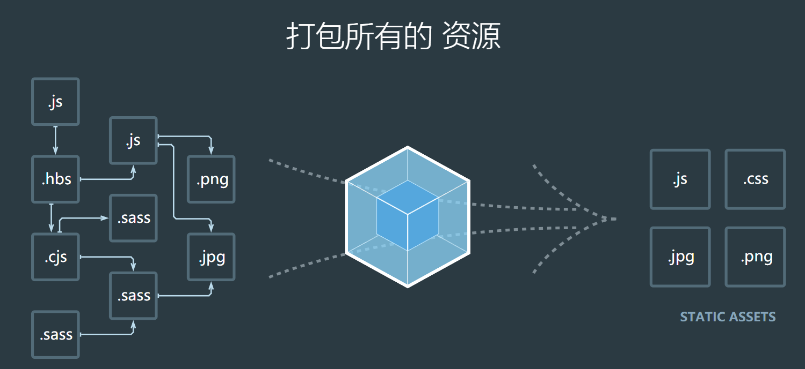

**与 grunt/gulp 等区别：**
<br>
1.runt 与 gulp 属于自动化流程工具，通过配置文件指明对哪些文件执行编译、组合、压缩等具体任务，由工具自动完成这些任务。
<br>
2.webpack 作为模块化打包工具，把项目作为一个整体，通过入口文件，递归找到所有依赖文件，通过 loader 和 plugin 针对文件进行处理，最后打包生成不同的 bundle 文件。

## 2.webpack 基本配置

&nbsp;&nbsp;&nbsp;&nbsp;&nbsp;&nbsp;&nbsp;当你想使用 webpack 打包项目时，需要在项目目录下新建 webpack.config.js，webpack 默认会读取 webpack.config.js 作为配置文件，进而执行打包构建流程。

&nbsp;&nbsp;&nbsp;&nbsp;&nbsp;&nbsp;&nbsp;先来看一下 webpack 的基本配置项，留个印象先。

**webpack.config.js**

```
const path = require('path');

module.exports = {
  mode: 'production/development/none', // 打包模式，使用对应模式的内置优化
  entry: './src/index.js', // 入口，支持单入口、多入口
  output: { // 输出相关配置
    filename: 'xx.js', // 输出文件的文件名
    path: path.resolve(__dirname, 'dist') // 输出文件的绝对路径，默认为dist
  },
  module: { // 针对不同类型文件的转换
    rules: [
      {
        test: /\.xx$/, // 针对某类型文件处理，使用正则匹配文件
        use: [
          {
            loader: 'xx-loader', // 使用xx-loader进行转换
            options: {} // xx-loader的配置
          }
        ]
      }
    ]
  },
  plugins: [ // 插件，完成特定任务，如压缩/拆分
    new xxPlugin({ options });
  ]
};

```

&nbsp;&nbsp;&nbsp;&nbsp;&nbsp;&nbsp;&nbsp;webpack 有五个核心概念：入口(entry)、输出(output)、模式（mode）、loader、插件(plugins)。

## 2.1.入口（entry）

入口指示 webpack 应该使用哪个模块，来作为构建其内部依赖图的开始。默认值为`./src`。

### 2.1.1.单入口

单入口是指 webpack 打包只有一个入口，单入口支持单文件和多文件打包。

> 通常像 vue/react spa 应用都属于单入口形式，以`src/index.js`作为入口文件。

（1）单文件打包

> 不指定入口文件的 entryChunkName 时，默认为 main。

```
// webpack.config.js

module.exports = {
  entry: "./src/index.js"
};
```

上面的单入口语法，是下面的简写：

```
module.exports = {
  entry: {
    main: "./src/index.js"
  }
};
```

main 表示 entryChunkName 为 main，打包后生成的文件 filename 为 main。

webpack 打包后，dist 文件夹生成 main.js 文件。

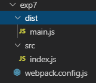

也可以将 entryChunkName 修改为其他值，打包出的 filename 也会对应改变。

（2）多文件打包

多文件打包入口以数组形式表示，表示将多个文件一起注入到 bundle 文件中。

```
module.exports = {
  entry: ["./src/index.js", "./src/main.js"]
};

```

### 2.1.2.多入口

多入口是指 webpack 打包有多个入口模块，多入口 entry 一般采用对象语法表示，应用场景：

（1）分离应用程序 app 和第三方入口(vendor)

```
module.exports = {
  entry: {
    app: "./src/index.js",
    vendor: "./src/vendor.js"
  }
};
```

webpack 打包后，生成应用程序 app.js 和 vendor.js。

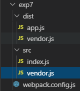

（2）多页面打包，一般指多个 html 文档形式，每个文档只使用一个入口。

```
module.exports = {
  entry: {
    app: "./src/app.js",
    home: "./src/home.js",
    main: "./src/main.js"
  }
};
```

webpack 打包后，dist 文件夹下生成 app.js、home.js、main.js 三个文件。

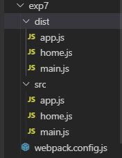

## 2.2.输出（output）

output 选项可以控制 webpack 如何输出打包文件，output 属性包含 2 个属性：

- filename：输出文件的文件名
- path：输出目录的绝对路径（注意是绝对路径）

> 即使存在多个入口起点，webpack 只有一个输出配置，不对 output 进行配置时，默认输出到./dist 文件夹。

### 2.2.1.单入口输出

单入口打包常用配置如下：

```
const path = require("path");

module.exports = {
  entry: {
    app: "./src/app.js"
  },
  output: {
    filename: "bundle.js",
    path: path.resolve(__dirname, "dist") // __dirname表示js文件执行的绝对路径，使用path.resolve生成dist文件夹的绝对路径
  }
};
```

webpack 打包后，dist 文件夹下生成 bundle.js 文件

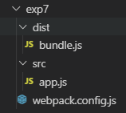

### 2.2.2.多入口输出

当存在多入口时，应该使用占位符来确保每个文件具有唯一的名称，否则 webpack 打包会报错。


> **占位符 name 与 entry 对象中的 key 一一对应**。

正确的写法如下：

```
const path = require("path");

module.exports = {
  entry: {
    app: "./src/app.js",
    main: "./src/main.js",
    home: "./src/home.js"
  },
  output: {
    filename: "[name].js", // 使用占位符来表示
    path: path.resolve(__dirname, "dist")
  }
};
```

webpack 打包后，在 dist 文件夹下生成了 app.js、home.js、main.js 文件。

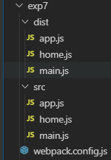

### 2.2.3.hash、chunkhash、contenthash 揭秘

在揭秘 hash、chunkhash、contenthash 之前，我们先看下 webpack 打包输出信息。

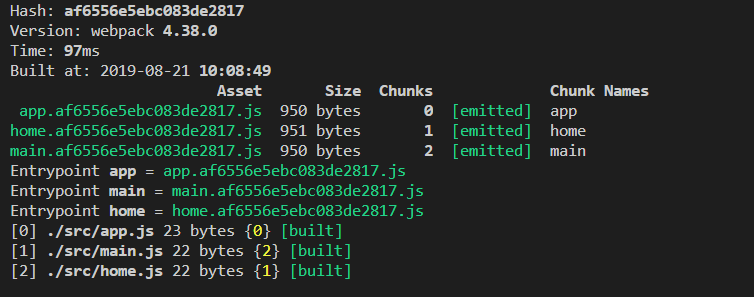

Hash：与整个项目构建相关，当项目中不存在文件内容变更时，hash 值不变，当存在文件修改时，会生成新的一个 hash 值。
<br>
Version：webpack 版本
<br>
Time：构建时间
<br>
Build at：开始构建时间
<br>
Asset：输出文件
<br>
Size：输出文件大小
<br>
Chunks：chunk id
<br>
ChunkNames：对应 entryChunkName
<br>
Entrypoint：入口与输出文件的对应关系

如果使用占位符来表示文件，当文件内容变更时，仍然生成同样的文件，无法解决浏览器缓存文件问题。借助于 hash、chunkhash、contenthash 可以有效解决问题。

#### （1）hash

整个项目构建生成的一个 md5 值，项目文件内容不变，hash 值不变。

使用 hash 关联输出文件名称

```
const path = require("path");

module.exports = {
  entry: {
    app: "./src/app.js",
    main: "./src/main.js",
    home: "./src/home.js"
  },
  output: {
    filename: "[name].[hash].js",
    path: path.resolve(__dirname, "dist")
  }
};

```

> filename: "[name].[hash:7].js"表示去 hash 值的前 7 位

webpack 打包，看到新生成文件带上了 hash 值

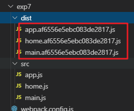

当我们修改 app.js 文件内容后，重新打包，发现可以生成了新的 hash 值，所有文件的名称都发生了变更。

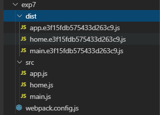

**问题**：当我修改了项目中的任何一个文件时，导致未修改文件缓存都将失效。

#### （2）chunkhash

webpack 构建时，根据不同的入口文件，构建对应的 chunk，生成对应的 hash 值，每个 chunk 的 hash 值都是不同的。

使用 chunkhash 关联文件名

```
const path = require("path");

module.exports = {
  entry: {
    app: "./src/app.js",
    main: "./src/main.js",
    home: "./src/home.js"
  },
  output: {
    filename: "[name].[chunkhash].js",
    path: path.resolve(__dirname, "dist")
  }
};

```

使用 webpack 打包后，dist 目录下，每个 bundle 文件都带有不同的 chunkash 值。

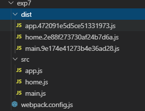

修改 app.js 内容，重新打包，只有 app 文件名称发生了变更。


使用 chunkhash 可以有效解决 hash 缓存失效问题，但是当在 js 文件里面引入 css 文件时，将 js、css 分别打包，若 js 件内容变化时，css 文件名称也会变更。

app.js 中引入了 css 文件

```
import "./css/style.css";

console.log("app");
```

webpack 配置

```
const path = require("path");
const miniCssExtractPlugin = require("mini-css-extract-plugin");
const { CleanWebpackPlugin } = require("clean-webpack-plugin");

module.exports = {
  entry: {
    app: "./src/app.js",
    main: "./src/main.js",
    home: "./src/home.js"
  },
  module: {
    rules: [
      {
        test: /\.css$/,
        use: [miniCssExtractPlugin.loader, "css-loader"]
      }
    ]
  },
  output: {
    filename: "[name].[chunkhash].js",
    path: path.resolve(__dirname, "dist")
  },
  plugins: [
    new CleanWebpackPlugin(), // 清空dist目录
    new miniCssExtractPlugin({
      // 抽离css文件
      filename: "css/style.[chunkhash].css"
    })
  ]
};
```

打包，dist 文件夹下生成了 css 与 js 文件，chunkhash 一致。

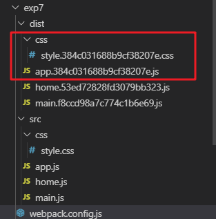

当我们修改 app.js 文件内容后，重新打包，发现 css 文件名也变更了，css 文件缓存将失效，这显然不是我们想要的结果。

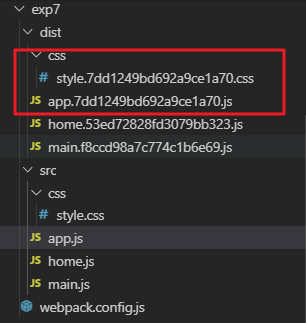

**问题**：js 引入 css 等其他文件时，js 文件变更，css 等文件名也会变更，缓存失效。

#### （3）contenthash

contenthash 表示由文件内容产生的 hash 值，内容不同产生的 contenthash 值也不一样。借助于 contenthash 可以解决上述问题，只要 css 文件不变，缓存一直有效。

修改 webpack 配置，css filename 使用 contenthash 表示。

```
const path = require("path");
const miniCssExtractPlugin = require("mini-css-extract-plugin");
const { CleanWebpackPlugin } = require("clean-webpack-plugin");

module.exports = {
  entry: {
    app: "./src/app.js",
    main: "./src/main.js",
    home: "./src/home.js"
  },
  module: {
    rules: [
      {
        test: /\.css$/,
        use: [miniCssExtractPlugin.loader, "css-loader"]
      }
    ]
  },
  output: {
    filename: "[name].[contenthash].js",
    path: path.resolve(__dirname, "dist")
  },
  plugins: [
    new CleanWebpackPlugin(), // 清空dist目录
    new miniCssExtractPlugin({
      // 抽离css文件
      filename: "css/style.[contenthash].css"
    })
  ]
};

```

打包后，dist 目录下，生成了 css、js 文件，app 文件包含 chunkhash 值，css 文件包含 contenthash 值。

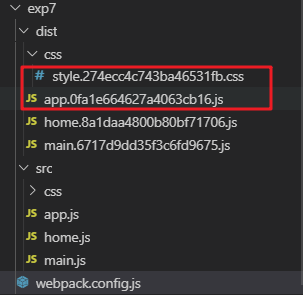;

修改 app.js 文件内容，重新打包，app 文件重命名了，css 文件没变，缓存有效。

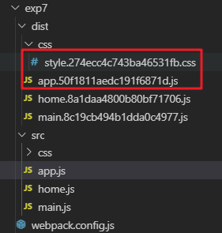

> **项目中 css 等非 js 文件抽离最好使用 contenthash。**

### 2.3.模式（mode）

webpack 提供了 mode 配置选项，用来选择使用响应的内置优化，不配置 mode 选项时，默认使用 production 模式。

mode 选项有 3 个可选值：production（生产模式、默认）、development、none。

#### 2.3.1.production 模式

production 模式下，会自动开启 Tree Shaking（去除无用代码）和文件压缩（UglifyJs）。

在 fun.js 中定义了 2 个函数

```
export function f1() {
  console.log("f1");
}

export function f2() {
  console.log("f2");
}
```

在 app.js 中只引入了 f1

```
import { f1 } from "./fun";

f1();
```

production 模式打包，查看打包后的文件，只引入了 f1，并且代码进行了压缩。

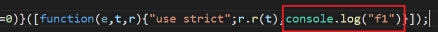

#### 2.3.2.development 模式

development 模式下，webpack 会启用 NamedChunksPlugin 和 NamedModulesPlugin 插件。

同样的代码，development 模式下打包，将 f1 和 f2 都一起打包了，而且代码并没有进行压缩。

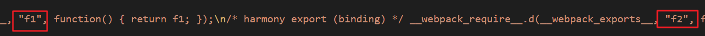

#### 2.3.3.none 模式

none 模式下，webpack 不会使用任何内置优化，这种模式很少使用。

### 2.4.loader

loader 用于对模块的源代码进行转换。loader 可以实现文件内容的转换，比如将 es6 语法转换为 es5 语法，将 scss 转换为 css 文件，将 image 转换为 base 64 位编码。一般 loaderp 配置在 module 的 rules 选项中。

常用的 loader 有：

- 处理 js/jsx/ts
  <br>
  bebel-loader：将代码转换为 ES5 代码
  <br>
  ts-loader：将 ts 代码转换为 js 代码
- 处理样式
  <br>
  style-loader：将模块的导出作为样式添加到 DOM style 中
  <br>
  css-loader：解析 css 文件后，使用 import 加载，并且返回 CSS 代码
  <br>
  less-loader：加载和转译 less 文件
  <br>
  sass-loader：加载和转译 sass/scss 文件
- 文件转换
  <br>
  file-loader：将文件发送到输出文件夹，返回相对 url，一般用于处理图片、字体
  <br>
  url-loader：和 file-loader 功能一样，但如果文件小于限制，返回 data URL，常用于图片 base 64 转换

下面就以 scss 转换的例子，描述如何使用 loader

app.js 中引入了 main.scss 文件

```
// app.js

import "./css/main.scss";
```

webpack 配置如下

```
const path = require("path");
const miniCssExtractPlugin = require("mini-css-extract-plugin");
const { CleanWebpackPlugin } = require("clean-webpack-plugin");

module.exports = {
  mode: "development",
  entry: {
    app: "./src/app.js"
  },
  module: { // 针对项目中不同类型模块的处理
    rules: [ // 匹配请求的规则数组
      {
        test: /\.scss$/, // 检测scss文件结尾的文件
        exclude: /node_modules/, // 排除查找范围
        include: [path.resolve(__dirname, "src/css")], // 限定查找范围
        use: [miniCssExtractPlugin.loader, "css-loader", "sass-loader"] // loader链式调用，从最右边向左处理
      }
    ]
  },
  output: {
    filename: "[name].[chunkhash].js",
    path: path.resolve(__dirname, "dist")
  },
  plugins: [
    new CleanWebpackPlugin(), // 清空dist目录
    new miniCssExtractPlugin({
      // 抽离css文件
      filename: "css/style.[contenthash].css"
    })
  ]
};

```

其中，sass-loader 用于将 scss 文件编译成 css 文件，css-loader 用于解释 import()，miniCssExtractPlugin 用于将 css 抽离到单独的文件中。

关于 loader 有几点说明：

1.loader 支持链式调用，一组链式 loader 按照相反的顺序执行，loader 链中的前一个 loader 返回值给下一个 loader，最后一个 loader 输出文件。
<br>
上面例子中，loader 执行顺序：sass-loader => css-loader => miniCssExtractPlugin.loader。

2.loader 可以使用 options 对象进行配置，像下面这样：

```
module: {
    //
    rules: [
      {
        test: /\.scss$/, // 检测scss文件结尾的文件
        exclude: /node_modules/, // 排除查找范围
        include: [path.resolve(__dirname, "src/css")], // 限定查找范围
        use: [
          miniCssExtractPlugin.loader,
          {
            loader: "css-loader",
            options: {
              modules: true
            }
          },
          "sass-loader"
        ] // loader链式调用，从最右边向左处理
      }
    ]
  },
```

### 2.5.plugins（插件）

插件是 webpack 的支柱功能，旨在解决 loader 无法实现的其他事。插件可以携带参数，配置插件需要向 plugins 数组中传入 new 实例。

常用的插件有：

clean-webpack-plugin：清空 dist 文件夹
<br>
clean-webpack-plugin：生成 html 文件
<br>
mini-css-extract-plugin：抽离 css 文件
<br>
optimize-css-assets-webpack-plugin：优化和压缩 css
<br>
css-split-webpack-plugin：针对 css 大文件进行拆分
<br>
webpack-bundle-analyzer：webpack 打包结果分析
<br>
webpack.DllPlugin：创建 dll 文件和 manifest 文件
<br>
webpack.DllReferencePlugin：把只有 dll 的 bundle 引用到需要的预编译的依赖。
<br>
SplitChunksPlugin：拆分代码块，在 optimization.splitChunks 中配置。

下面以 html-webpack-plugin 为例说明 plugins 的用法，这里只列出 plugins 部分的配置

```
plugins: [
    new CleanWebpackPlugin(), // 清空dist目录
    new miniCssExtractPlugin({
      // 抽离css文件
      filename: "css/style.[contenthash].css"
    }),
    new HtmlWebpackPlugin({ // 生成插件实例
      filename: "index.html", // 生成模板的名称
      minify: {
        collapseWhitespace: true, // 去除空格
        minifyCSS: true, // 压缩css
        minifyJS: true, // 压缩js
        removeComments: true, // 移除注释
        removeEmptyElements: true, // 移除空元素
        removeScriptTypeAttributes: true, // 移除script type属性
        removeStyleLinkTypeAttributes: true // 移除link type属性
      }
    })
  ]
```

打包后，生成了 index.html 文件

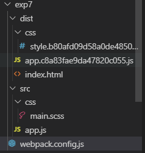

打开 index.html，看到 css 和 js 文件被引入了

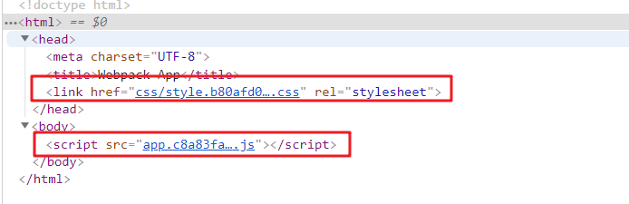

接下来描述 webpack 其他常用的一些配置 resolve、devServer、devtool。

### 2.6.resolve（解析）

resolve 选项设置模块如何被解析。

#### 2.6.1.alias

创建 import 或 require 的别名，确保模块引入变得简单。

下面的例子针对 css、util 文件夹 设置了 alias 别名，引入文件夹下面的文件可以直接使用相对地址。

```
resolve: {
    alias: {
      css: path.resolve(__dirname, "src/css"),
      util: path.resolve(__dirname, "src/util")
    }
  },
```

app.js 文件中引入 util 文件夹下的 common.js 文件，就会引入 src/util/common.js 文件。

```
import fun1 from "util/common.js";
```

#### 2.6.2.extensions

自动解析引入模块的扩展，按照从左到右的顺序解析。

```
resolve: {
  extensions: [".js", ".json"]
}
```

在 app.js 中引入 common.js 可以不携带后缀，由 webpack 自动解析。

```
import fun1 from "util/common";
```

#### 2.6.3.mainFiles

解析目录时要使用的文件名，默认

```
mainFiles: ["index"]
```

也可以指定多个 mainFiles，会依次从左到右解析

```
mainFiles: ["index", "main"]
```

比如需要从 util 文件夹下引入 index.js 文件，import 只需要导入到 util 文件夹，webpack 会自动从 util 文件夹下引入 index.js 文件。

```
import index from "util";
```

> **extentsion 和 mainFiles 属性虽然会方便开发者简写，但是会增加 webpack 额外的解析时间。**

### 2.7.devServer

devServer 主要用于 development 模式配置本地开发服务器，需要安装 webpack-dev-server。

```
npm i webpack-dev-server -g
```

devServer 常用的配置项如下：

```
devServer: {
    contentBase: path.resolve(__dirname, "dist"), // 告诉服务器从哪里提供内容
    host: "localhost", // 制定一个host，默认localhost
    port: 3000, // 请求端口号，默认8080
    compress: true, // 启用gzip压缩
    https: true, // 开启http服务
    hot: true, // 启用模块热替换
    open: true, // 自动打开默认浏览器
    index: "index.html", // 页面入口html文件，默认index.html
    headers: {
      // 所有响应中添加首部内容
      "X-Custom-Foo": "bar"
    },
    proxy: {
      "/api": "http://localhost:3000"
    }
  }
```

读取配置文件，启动开发服务器。

```
webpack-dev-server --config webpack.dev.js
```

### 2.8.devtool

source map 一个存储源代码与编译代码对应位置的映射信息文件，它是专门给调试器准备的，它主要用于 debug。

webpack 通过配置 devtool 属性来选择一种 source map 来增强调试过程。

以下是官方对于 devtool 的各种 source map 的比较：

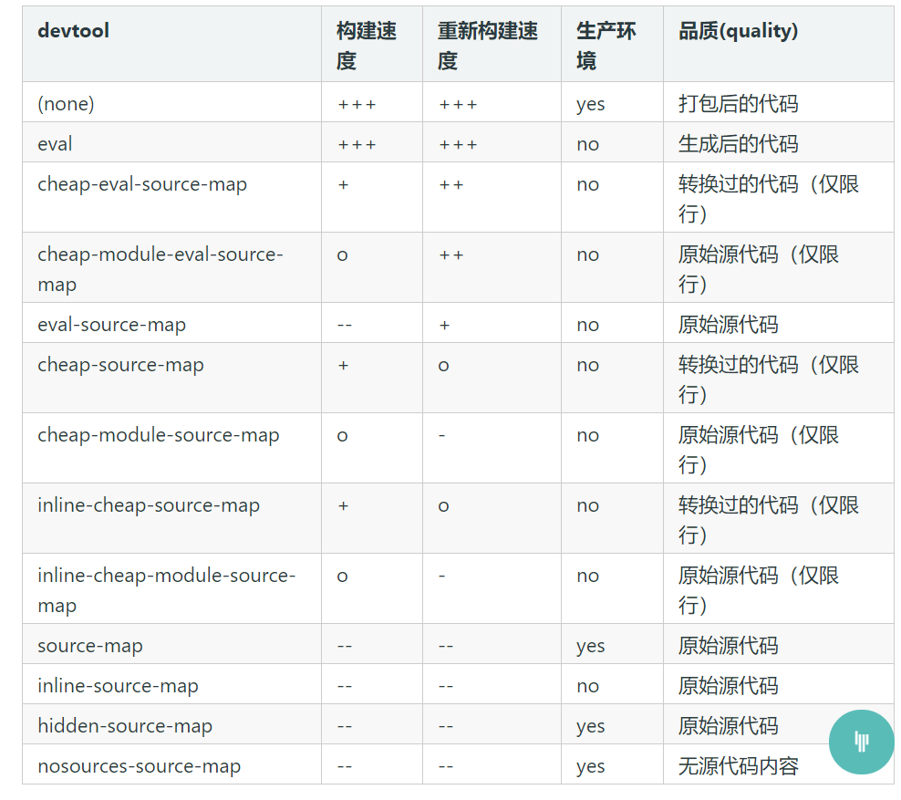

> **development 模式下 devtool 设置为 cheap-module-eval-source-map，production 模式下 devtool 设置为 souce-map。**

## 3.webpack 实践

接下来将通过一个完整的例子实现 react 项目的完整 webpack 配置。
先全局安装 webpack 和 webpack-dev-server。

```
npm i webpack webpack-dev-server -g
```

### 3.1.配置执行文件

新建一个目录，结构如下：

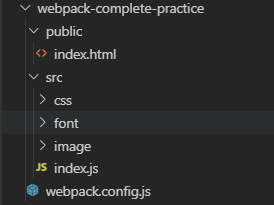

其中 public 文件夹下包含 index.html 入口 html 文件，src 文件夹下包含 index.js 入口 js 文件，css 文件夹、font 文件夹、image 文件夹。

webpack 配置如下：

```
// webpack.config.js

const path = require("path");

module.exports = {
  entry: "./src/index.js",
  output: {
    filename: "[name].[chunkhash:7].js",
    path: path.resolve(__dirname, "dist")
  }
};
```

在目录下使用`npm init`新建 package.json 文件，设置 dev 和 build 的 script，
分别用于开发模式和生产模式。


### 3.1.处理 jsx、es6

在 react 项目中，我们使用 jsx 和 es6 语法，为了兼容低版本浏览器，需要通过 babel 转换。

### 3.2.配置 html 模板

### 3.3.处理 css、scss 文件

### 3.4.处理图片、字体文件

### 3.5.配置 devServer

### 3.6.提取公共代码

### 3.7.分离 webpack 配置文件

### 3.8.扩展：如何编写一个 loader

### 3.9.扩展：如何实现一个 plugin

### 3.10.webpack 相关优化
